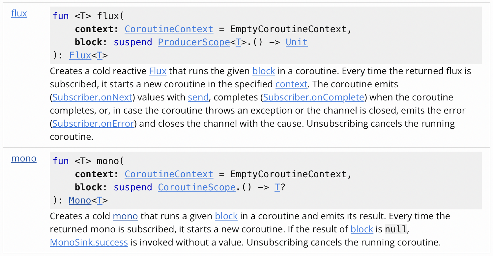
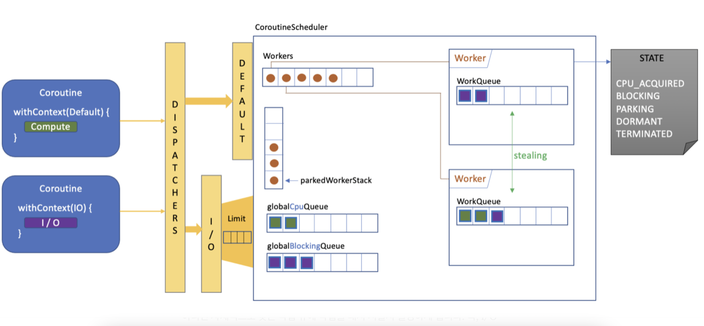

코루틴 스터디

---


### [4장 일시 중단 함수와 코루틴 컨텍스트 ](http://www.kyobobook.co.kr/product/detailViewKor.laf?mallGb=KOR&ejkGb=KOR&barcode=9791161754222)(w/ 생각의 흐름)


- 일시 중단 함수의 개요

- 일시 중단 함수를 사용하는 방법

- 일시 중단 함수 대신 비동기 함수를 사용하는 경우

- 코루틴 컨텍스트

- 디스패처, 예외 처리기 및 취소 불가와 같은 다양한 유형의 컨텍스트

- 코루틴 동작을 정의하기 위한 컨텍스트의 결합 및 분리

  

위 주제의 내용이 정리되어 있습니다.


#### **일시 중단 함수**

**코루틴 빌더를 호출 할 때 전달하는 코드는 일시 중단 함수 (suspend)** 이며 코드 작성법은 아래와 같습니다.


ex/

```kotlin
suspend fun greeetDelayes(delayMillis: Long) {
  delay(delayMillis)
  println("Hello, world!")
}
```

일시 중단 함수를 만들려면 시그니처에 suspend 제어자만을 추가하면 됩니다.

일시 중단 함수는 **delay() 와 같은 다른 일시 중단 함수를 직접 호출이 가능**합니다.

(비 일시 중단 코드에서 함수를 호출하려면 아래와 같이 코루틴 빌더로 감싸주어야 합니다)


ex/

```kotlin
fun main(args: Array<String>) {
  runBlocking {
    greetDelayed(1000)
  }
}
```


---


#### 동작 중인 함수를 일시 중단

일시 중단 함수를 활용하여 (저자 입장에서 더 편리하다고 말하는) 비동기 함수를 확장해보고 사례를 통해 비교해보고자 합니다.


> 우리는 비동기 함수를 구현한 잡(Job) 을 (디퍼드(Deferred) 를 토함해서) 반환하는 함수라고 했다. 이러한 함수는 보통은 launch() 또는 async() 빌더로 감싸인 함수이지만, 구현한 잡이 반환될 때만 비동기 함수로 본다.


1. 비동기 함수로 레파지토리 작성
잡 구현을 반환하는 함수가 있다면 편리할 수 있지만, **코루틴이 실행되는 동안에 일시 중단을 위해서 join() 이나 await() 를 사용하는 코드가 필요하다는 단점**이 생깁니다.


ex/

```kotlin
interface ProfileServiceRepository {
  fun asyncFetchById(id: Long): Deferred<Profile>
  // @description 갓루틴 책에서 말하는 네이밍 컨벤션입니다.
}

class ProfileServiceClient: ProfileServiceRepository {  
  override fun asyncFetchById(id: Long): GlobalScope.async {
    // @description GlobalScope.async 를 열어주고 Deferred 를 사용합니다.
    return Profile(someValue)
  }
}

fun main(args: Array<String>) = runBlocking {
  val client: ProfileServiceRepository = ProfileServiceClient()
  val profile = client.asyncFetchById(1).await()
  // @description 요청이 완료될 때까지 일시 정지해야하므로 함수 호출 직후에 await() 호출이 있게 됩니다.
}
```


※ 코드가 지저분해보이고 군더더기가 많아보입니다.

※ CoroutineScope 는 각각의 라이프 사이클을 별도로 가지고 종료를 할 수 있는 반면 **GlobalScope 는 싱글톤으로 만들어져있어, 잘못 활용한다면 프로그램 전체에 악영향**을 미칠 수 있다.


ref: [kotlinx.coroutines GlobalScope](https://kotlin.github.io/kotlinx.coroutines/kotlinx-coroutines-core/kotlinx.coroutines/-global-scope/index.html)


***GlobalScope 를 쓰면 어떤 쓰레드에서 도는지 = Dispatchers.Default**


Global scope is used to launch top-level coroutines which are operating on the whole application lifetime and are not cancelled prematurely.

> **top-level에서 동작하는 코루틴이고, application의 라이프사이클 동안 동작하는데, 각각의 화면과 무관하게 종료됩니다.**


Active coroutines launched in `GlobalScope` do not keep the process alive. They are like daemon threads.

> **GlobalScope 에서 시작된 활성 코루틴은 프로세스를 활성 상태로 유지하지 않습니다. 마치 데몬 쓰레드와 같습니다.**


This is a **delicate** API. It is easy to accidentally create resource or memory leaks when `GlobalScope` is used. A coroutine launched in `GlobalScope` is not subject to the principle of structured concurrency, so if it hangs or gets delayed due to a problem (e.g. due to a slow network), it will stay working and consuming resources.

> **이것은 섬세한 API 입니다. GlobalScope를 사용하면 실수로 리소스나 메모리 누수를 생성하기가 쉽습니다. GlobalScope에서 출시된 코루틴은 구조화된 동시성의 원칙의 적용을 받지 않기 때문에 문제가 발생하여 코루틴이 중단되거나 지연되면(예: 느린 네트워크로 인해) 계속 작동하며 리소스를 소비하게 됩니다.**


블로그를 참고해보니 안드로이드 현업 개발자의 경우에도 이러한 리스크로 인해 잘 사용하지 않는다고 합니다.
(문서를 조금 더 보려고 했지만, 크게 이점이 없는 것 같아 굳이 찾아보지 않기로 했습니다.)


**∴ GlobalScope 의 사용은 지양하자 (정말 필요한 곳에만 쓰자?)**


**2. 일시 중단 함수로 업그레이드** (refactoring)


ex/

```kotlin
interface ProfileServiceRepository {
  suspend fun fetchById(id: Long): Profile
}

class ProfileServiceClient: ProfileServiceRepository {  
  override suspend fun fetchById(id: Long): Profile {
    return Profile(someValue)    
  }
}

fun main(args: Array<String>) = runBlocking {
  val client: ProfileServiceRepository = ProfileServiceClient()
  val profile = client.fetchById(1)
}
```


비동기 구현에 비해 분명한 이점이 있습니다.

1. **유연함**: 인터페이스의 상세 구현 내용은 노출되지 않기 때문에 **퓨처를 지원하는 모든 라이브러리를 구현에서 사용할 수 있습니다.**
2. **간단함**: 순차적으로 수행하려는 작업에 비동기 함수를 사용하면 **항상 await() 를 호출해야 하는 번거로움이 없어집니다.**


**Q. 혹시 Spring Reactor 와도 결합이 가능할까요?**


마침 api-gw 에 결합하여 사용하고 있는 케이스가 있습니다 ([api-gw](http://github.com/tossbank/apigw))


[java base webflux sequence](https://github.com/tossbank/apigw/blob/develop/src/main/kotlin/com/tossbank/apigw/filter/FraudDetectionTransactionSuspectFilter.kt)

```kotlin
override fun apply(twoFactorCheckedRequest: TwoFactorCheckedRequest): GatewayFilter {
        return GatewayFilter { exchange: ServerWebExchange, chain: GatewayFilterChain ->
            findUserIdByExchangeAttributes(exchange)
                .filter { it != null }
                .filter { isCheckedResponse(exchange.response) }
                .filter { isCheckedRequest(twoFactorCheckedRequest.requests, exchange.request) }
                .flatMap { userId ->
                    return@flatMap findFdsSuspectVerifyResultByUserId(userId)
                        .filter { it.isSuspect() }
                        .map { it.result }
                        .flatMap {
                            val response = exchange.response

                            response.statusCode = HttpStatus.UNAUTHORIZED
                            response.headers[HttpHeaders.CONTENT_TYPE] = MediaType.APPLICATION_JSON_VALUE
                            response.headers[HttpHeaders.WWW_AUTHENTICATE] = HeaderConstants.AUTHORIZATION_TOKEN_SCHEME
                            response.writeWith(
                                Mono.just(
                                    exchange.response.bufferFactory()
                                        .allocateBuffer()
                                        .write(it.toByteArray())
                                )
                            )
                        }
                        .then()
                }
                // @description 에러 발생시 로그만 발생시키고 종료시키고 직접적인 차단은 FDS 서버에서 진행한다.
                .onBackpressureBuffer()
                .switchIfEmpty(Mono.empty())
                .transformDeferred(CircuitBreakerOperator.of(bankFdsServerCircuitBreaker))
                .doOnError { logger.error("$this ${it.message}", it) }
                .onErrorResume(Exception::class.java) { chain.filter(exchange) }
                .then(chain.filter(exchange))
        }
    }
```


[kotlin base webflux sequence](https://github.com/tossbank/apigw/blob/develop/src/main/kotlin/com/tossbank/apigw/filter/DigitalSignFilter.kt)

```kotlin
override fun apply(digitalSignCheckedRequest: DigitalSignCheckedRequest): GatewayFilter {

        return GatewayFilter { exchange: ServerWebExchange, chain: GatewayFilterChain ->
            val checkedRequest = getCheckedRequest(digitalSignCheckedRequest.requests, exchange.request)
            val txId = exchange.request.headers[DIGITAL_SIGN_TX_ID_KEY]?.first()?.toLong()

            val userId = exchange.attributes[USER_ID_KEY]

            if (!tempApplyFilterUserList.contains(userId)) {
                chain.filter(exchange)
            } else if (checkedRequest == null || checkedRequest.isSelfMakeDoc) {
                chain.filter(exchange)
            } else if (txId == null) {
                mono(Dispatchers.Unconfined) {
                    val serverRequest = ServerRequest.create(exchange, serverCodecConfigurer.readers)
                    val doc = serverRequest.bodyToMono(String::class.java)
                        .switchIfEmpty(Mono.just("{\"url\" : \"${exchange.request.path}\", \"params\" : \"${exchange.request.queryParams}\", \"httpMethod\" : \"${exchange.request.methodValue}\" }"))
                        .awaitSingle()
                    val userId = findExchangeAttributesByKey(exchange, USER_ID_KEY).toLong()
                    try {
                        val prepareSignDoc = prepareSignDoc(doc = doc, userId = userId)
                        logger.info(
                            "전자서명 준비 request(userId=$userId, path=${exchange.request.path}) :${toJsonString(doc)}"
                        )
                        exchange.response.statusCode = HttpStatus.UNPROCESSABLE_ENTITY
                        exchange.response.headers[HttpHeaders.CONTENT_TYPE] = MediaType.APPLICATION_JSON_VALUE
                        val signPrepareResponse = TossBankErrorResponse(
                            code = "NEED_SIGN",
                            message = "need header value : sign-tx-id",
                            errorData = mapOf(
                                "doc" to doc,
                                "txId" to prepareSignDoc.txId,
                                "clientId" to prepareSignDoc.clientId
                            )
                        )
                        logger.info(
                            "전자서명 준비 response(userId=$userId, path=${exchange.request.path}) : ${
                            toJsonString(
                                signPrepareResponse
                            )
                            }"
                        )
                        exchange.response.writeWith(
                            Mono.just(
                                exchange.response.bufferFactory()
                                    .allocateBuffer()
                                    .write(
                                        signPrepareResponse.toByteArray()
                                    )
                            )
                        )
                    } catch (e: WebClientResponseException) {
                        webClientProxyErrorResponse(exchange.response, e)
                    }
                }.flatMap { it }
```


ref: [kotlinx.coroutines reactor](https://kotlin.github.io/kotlinx.coroutines/kotlinx-coroutines-reactor/kotlinx.coroutines.reactor/index.html)


### Functions




Creates a cold [mono](https://projectreactor.io/docs/core/3.4.1/api/reactor/core/publisher/Mono.html) that runs a given [block](https://kotlin.github.io/kotlinx.coroutines/kotlinx-coroutines-reactor/kotlinx.coroutines.reactor/mono.html#kotlinx.coroutines.reactor$mono(kotlin.coroutines.CoroutineContext, kotlin.SuspendFunction1((kotlinx.coroutines.CoroutineScope, kotlinx.coroutines.reactor.mono.T)))/block) in a coroutine and emits its result. Every time the returned mono is subscribed, it starts a new coroutine. If the result of [block](https://kotlin.github.io/kotlinx.coroutines/kotlinx-coroutines-reactor/kotlinx.coroutines.reactor/mono.html#kotlinx.coroutines.reactor$mono(kotlin.coroutines.CoroutineContext, kotlin.SuspendFunction1((kotlinx.coroutines.CoroutineScope, kotlinx.coroutines.reactor.mono.T)))/block) is `null`, [MonoSink.success](https://projectreactor.io/docs/core/3.4.1/api/reactor/core/publisher/MonoSink.html#success()) is invoked without a value. Unsubscribing cancels the running coroutine.

> **지정된 블록을 코루틴에서 실행하고 결과를 내보내는 콜드 시퀀스 (Cold sequences) 를 생성합니다. 반환된 모노가 구독될 때마다 새 코루틴이 시작됩니다. 구독을 취소하면 실행 중인 코루틴이 취소됩니다.**


**Q. 그럼 Hot sequences 방식 구현이 필요할 때에는 어떻게 사용해야할까요?** (애초에 존재하는지도 물음표)


ref: [medium Cold flows, hot channels](https://elizarov.medium.com/cold-flows-hot-channels-d74769805f9)


#### **Hot channels**

Channel 은 옵저버 등록 없이도 데이터를 보관할 수 있으며 상태에 따라서 이를 활용하면 개이득일 수 있지만, **subscribe 전까지 데이터를 보관하게 되는 단점**이 생긴다고 합니다.


```kotlin
suspend fun foo(p: Params): Value =
    withContext(Dispatchers.Default) { bar(p) }
```


channel 의 다른편에는 값을 생산하기 위해 일하는 코루틴이 있기 때문에, ReceiveChannel 에 대한 참조를 분리할수 없습니다. 왜냐하면 **생산자는 소비자를 기다리며, 메모리 자원을 낭비, 네트워크 연결 개방등을 하며 영원히 중단될 것이기 때문**입니다.


몇가지 개선하는 방법이 있다고 하지만 모든 문제를 해결하지는 못한다고 합니다. **channel 은 본질적으로 hot 데이터 소스와 애플리케이션의 요청 없이 존재하는 데이터소스 (수신 네트워크 연결, 이벤트 스트림 등)를 모델링하는 곳에 적합하다고 합니다.**


**일시 중단 함수와 비동기 함수**

비동기 함수 대신 일시 중단 함수를 사용하기 위한 가이드라인은 다음과 같습니다.


- 일반적으로 구현에 Job 이 엮이는 것을 피하기 위해서는 **일시 중단 함수를 사용하는 것이 좋습니다.**
- **인터페이스를 정의할 때는 항상 일시 중단 함수를 사용**한다. 비동기 함수를 사용하면 Job 을 반환하기 위한 구현을 해야 합니다.
- **마찬가지로 추상 함수를 정의할 때는 항상 일시 중단 함수를 사용**합니다. **가시성이 높은 함수일수록 일시 중단 함수를 사용**해야 합니다. 


---


#### 코루틴 컨텍스트

코루틴은 항상 컨텍스트 안에서 실행됩니다. 컨텍스트는 코루틴이 어떻게 실행되고 동작해야 하는지를 정의할 수 있게 해주는 요소들의 그룹입니다.


> 컨텍스트는 실제로 둘 이상의 요소를 포함할 수 있습니다. 이번 장에서는 결합된 동작을 생성하기 위해 컨텍스트에서 요소를 추가하고 제거하는 방법을 설명합니다.


**디스패쳐**

코루틴이 실행될 스레드를 결정하는데 여기에는 시작될 곳과 중단 후 재개될 곳을 모두 포함합니다.


**Default** (정정)

**CPU 바운드 작업을 위해서 프레임워크에 의해 자동으로 생성되는 스레드 풀**입니다.

`스레드 풀의 최대 크기는 시스템의 코어 수에서 1을 뺀 값`이며 현재는 **기본 디스패쳐로 사용**되지만 용도를 명시할 수도 있습니다.


ref: [kotlinx.coroutines Dispatchers Default](https://kotlin.github.io/kotlinx.coroutines/kotlinx-coroutines-core/kotlinx.coroutines/-dispatchers/-default.html)

`JVM의 공유 스레드 풀을 통해 지원됩니다. 기본적으로 이 디스패치가 사용하는 최대 스레드 수는 CPU 코어 수와 동일하지만 최소 2개`입니다.


**CommonPool != Default (p.151)**


**Q. 책에서는 CPU 코어 -1 라고 하던데 공식 문서에서는 최대 CPU 코어수와 동일하다고 하는거 보니까 쓰레드 풀 개수를 조절할 수 있는 것 같은데 어떻게 하지?**


Dispatchers.IO 의 쓰레드 개수를 조절하는 방법 ([IO_PARALLELISM_PROPERTY_NAME](https://kotlin.github.io/kotlinx.coroutines/kotlinx-coroutines-core/kotlinx.coroutines/-i-o_-p-a-r-a-l-l-e-l-i-s-m_-p-r-o-p-e-r-t-y_-n-a-m-e.html)) 은 찾았는데 다른건 못찾겠습니다. 🙏🏽


ex/

```kotlin
GlobalScope.launch(Dispatchers.Default) {
  // 코드 작성
}
```


> CommonPool 이 기본 디스패쳐로써 지원하는 것을 중단할지는 확실하지 않지만, 예상치 못한 변경에 대비하기 위해 CPU 바운드 작업에 명시적으로 사용하는 것을 고려합니다.


**Unconfined**

**첫번째 중단 지점에 도착할 때까지 현재 스레드에 있는 코루틴을 실행**합니다. 코루틴은 일시 중지된 후에 **일시 중단 연산에서 사용된 기존 스레드에서 다시 시작**됩니다.


ref: [kotlinx.coroutins Dispatchers Unconfined](https://kotlin.github.io/kotlinx.coroutines/kotlinx-coroutines-core/kotlinx.coroutines/-dispatchers/-unconfined.html)

이 `디스패쳐에서 시작된 중첩 코루틴은 스택 오버플로를 방지하기 위해 이벤트 루프를 형성`합니다.


> suspend a() 가 특정 스레드에 있는 디스패처와 함께 실행되는 suspend b() 를 호출할 경우, a() 는 b() 가 실행된 같은 스레드에서 다시 시작되며 이것은 일시 중단 연산을 컴파일 하는 방식 때문에 발생한다고 합니다.
>
> 9장에서 상세하게 설명한다고 합니다 (태화님 👏🏻)


ex/

```kotlin
fun main(args: Array<String>) = runBlocking {
  GlobalScope.launch(Dispatchers.Unconfined) {
    println("Starting in ${Thread.currentThread().name}")
    delay(500)
    println("Resuming in ${Thread.currentThread().name}")
  }.join()
  // @description 내부적으로 event loop 방식으로 스레드 핸들링
}
```


... **시작은 main 스레드에서 실행** 중이였지만, 그 다음 **일시 중단 연산이 실행된 Default Executor 스레드로 이동**한 것을 보실 수 있습니다.


**너무 어렵고 이해가 안되서 찾아본 미디움 자료 👀**


ref: [medium 코루틴 디스패쳐 조금 더 살펴보기](https://myungpyo.medium.com/코루틴-디스패쳐-조금-더-살펴보기-92db58efca24)

> 코루틴 JVM 에서 Dispatchers 의 내부 구현을 살펴보면 **Dispatcher.Default 와 Dispatcher.IO 는 CoroutineScheduler 라는 동일한 스케줄러를 공유**한다고 합니다. 코루틴들은 디스패쳐를 통해 CoroutineScheduler 로 요청 될 때 Task 라는 형태로 래핑되어 요청된다고 합니다.
>
> 
>
> *Dispatchers.Default 는 **NonBlockingContext 로 표시되어 내부적으로 CPU intensive 한 작업들을 위한 큐를 이용하여 처리**되고, (웹플럭스 방식과 동일한 것으로 보입니다.)
>
> *Dispatchers.IO 는 **ProbablyBlockingContext 로 표시되어 내부적으로 I/O intensive 한 작업들을 위한 큐를 이용하여 처리**된다고 합니다.





---


**단일 스레드 컨텍스트**

**항상 코루틴이 특정 스레드 안에서 실행된다는 것을 보장**합니다. 유형의 디스패처를 생성하려면 newSingleThreadContext() 를 사용해야 합니다.


*CPU <> IO 차이 큼
(크고 빠른 연산을 처리할 때에는 CPU)


ex/

```kotlin
fun main(args: Array<String>) = runBlocking {
  val dispatcher = new SingleThreadContext("myThread")
  
  GlobalScope.launch(dispatcher) {
    println("Starting in ${Thread.currentThread().name}")
    delay(500)
    println("Resuming in ${Thread.currentThread().name}")
  }.join()
}
```


... **일시 중지 후에도 항상 같은 스레드에서 실행**됩니다.


**스레드 풀**

스레드 풀을 갖고 있으며 **해당 풀에서 가용한 스레드에서 코루틴을 시작하고 재개**합니다. **런타임이 가용한 스레드를 정하고 부하 분산을 위한 방법도 정하기 때문에 따로 할 작업은 없습니다.**


ex/

```kotlin
fun main(args: Array<String>) = runBlocking {
  val dispatcher = new SingleThreadContext(4, "myPool")
  
  GlobalScope.launch(dispatcher) {
    println("Starting in ${Thread.currentThread().name}")
    delay(500)
    println("Resuming in ${Thread.currentThread().name}")
  }.join()
}
```


... **myPool-1, myPool-2 등의 생성한 횟수만큼의 풀 (4) 을 가지고 코루틴을 시작**하게 됩니다.


**예외 처리**

코루틴 컨텍스트의 또 다른 중요한 용도는 **예측이 어려운 예외에 대한 동작을 정의**하는 것이며 이러한 유형은 **CoroutineExceptionHandler 를 구현**해 만들 수 있습니다.


ex/

```kotlin
fun main(args: Array<String>) = runBlocking {
  val handler = CoroutineExceptionHandler({ context, throwable ->
    println("Error captured in $context")
    println("Message: ${throwable.message}")
  })
  
  GlobalScope.launch(handler) {
    // 코드 작성
  }
  
  // wait for the error to happen
  delay(500)
}
```


... 

@todo. 이게 왜 에러인지?


**Non-cancellable**

**코루틴의 실행이 취소되면 코루틴 내부에 CancellationException 유형의 예외가 발생하고 코루틴이 종료**됩니다. 코루틴 내부에서 예외가 발생하기 때문에 try-finally 블록을 사용해 리소스를 닫는 클리닝 작업을 수행하거나 로깅을 수행할 수 있습니다.


ex/

```kotlin
fun main(args: Array<String>) = runBlocking {
  val duration = measureTimeMillis {
    val job = launch {
      try {
        while(isActive) {
          delay(500)
          println("still running")
        }
      } finally {
        println("cancelled, will end now")
      }
    }
    
    delay(1200)
    job.cancelAndJoin()
  }
  
  println("Took $duration ms")
}
```


... **코루틴을 취소할 때는 finally 블록이 실행**됩니다. 메인 스레드가 1.2초 동안 일시 중지된 다음 작업을 취소하고 애플리케이션 종료 전에 전체 실행 시간을 출력합니다.


이번에는 **코루틴이 종료되기 전에 5초 동안 멈추도록 finally 블록을 수정**해봅니다.


ex/

```kotlin
fun main(args: Array<String>) = runBlocking {
  val duration = measureTimeMillis {
    val job = launch {
      try {
        while(isActive) {
          delay(500)
          println("still running")
        }
      } finally {
        println("cancelled, will delay finalization now")
        delay(5000)
        println("cancelled, will end now")
      }
    }
    
    delay(1200)
    job.cancelAndJoin()
  }
  
  println("Took $duration ms")
}
```


... 하지만 finally 블록에서의 실제 지연은 일어나지 않았습니다. 코루틴이 일시 중단된 후 바로 종료되었습니다. 그 이유는 **취소중인 코루틴은 일시 중단될 수 없도록 설계되었기 때문**입니다. **코루틴이 취소되는 동안 일시 중지가 필요한 경우에는 NonCancellable 컨텍스트를 사용**해야 합니다.


ex/

```kotlin
fun main(args: Array<String>) = runBlocking {
  val duration = measureTimeMillis {
    val job = launch {
      try {
        while(isActive) {
          delay(500)
          println("still running")
        }
      } finally {
        withContext(NonCancellable) {
          println("cancelled, will delay finalization now")
          delay(5000)
          println("cancelled, will end now")
        }
      }
    }
    
    delay(1200)
    job.cancelAndJoin()
  }
  
  println("Took $duration ms")
}
```


... 코루틴의 취소 여부와 관계없이 **withContext() 에 전달된 일시 중단 람다가 일시 중단될 수 있도록 보장**해줍니다.


---


#### 컨텍스트에 대한 추가 정보

컨텍스트는 코루틴이 어떻게 동작할지에 대한 다른 세부사항들을 많이 정의할 수 있습니다. 뿐만 아니라 결합된 동작을 정의해 작동하기도 합니다.


**컨텍스트 조합**

**특정 스레드에서 실행하는 코루틴을 실행하고 동시에 해당 스레드를 위한 예외처리를 설정한다고 가정**합니다. 이를 위해 **더하기 연산자를 사용해 둘을 결합**할 수 있습니다.


ex/

```kotlin
fun main(args: Array<String>) = runBlocking {
  val dispatcher = newSingleThreadContext("myDispatcher")
  val handler = CoroutineExceptionHandler({ _, throwable ->
    println("Error captured")
    println("Message: ${throwable.message}")                                       
  })
  
  // val context = dispatcher + handler
  // 또는 변수로 만들어 활용할 수 있습니다.

  GlobalScope.launch(dispatcher + handler) {
    println("Running in ${Thread.currentThread().name}")
  }.join()
}
```


**컨텍스트 분리**

**결합된 컨텍스트에서 컨텍스트 요소를 제거**할 수도 있습니다. 이렇게 하려면 제거할 요소의 키에 대한 참조가 있어야 합니다.


ex/

```kotlin
fun main(args: Array<String>) = runBlocking {
  val dispatcher = newSingleThreadContext("myDispatcher")
  val handler = CoroutineExceptionHandler({ _, throwable ->
    println("Error captured")
    println("Message: ${throwable.message}")                                       
  })
  
  val context = dispatcher + handler

  val tmpCtx = context.minusKey(dispatcher.key)
  // 컨텍스트에서 하나의 요소를 제거
  
  GlobalScope.launch(tmpCtx) {
    println("Running in ${Thread.currentThread().name}")
  }.join()
}
```


**withContext 를 사용하는 임시 컨텍스트 스위치**

**이미 일시 중단 함수 상태에 있을 때 withContext() 를 사용해 코드 블록에 대한 컨텍스트를 변경**할 수 있습니다. withContext() 는 코드 블록 실행을 위해 주어진 컨텍스트를 사용할 일시 중단 함수입니다.


**Q. withContext 는 어디에 쓰는거지?**
(출처: https://sandn.tistory.com/99)

> 두 함수 모두 suspend fun으로서 코루틴 내부에서 블록을 중단시키기 때문에 유사해 보인다. 그러나, **coroutineScope는 withContext의 한 유형**으로 볼 수 있다. 즉, coroutineScope는 **withContext(this.coroutineContext)** 와 본질적으로 같은 의미를 지닌다. **coroutineScope는 Dispatcher를 설정할 수 없다 (무조건 현재 호출한 context를 사용하기 때문이다)**


**coroutineScope는 에러처리 등의 목적으로 특정 코드를 하나의 블럭으로 묶고 싶을 때 사용** 하며 **withContext는 해당 코드블럭을 특정 Context에서 실행하고 싶을 때 사용** 하게 됩니다. (ex/ 네트워크 작업을 위한 IO Dispatcher 등)

 

덧, 하지만 coroutineScope 내에서 Exception을 Throw하면 전체 부모 루틴이 중지된다고 하니 조심해야할 것 같습니다.

 

ex/

```kotlin
fun main(args: Array<String>) = runBlocking {
  val dispatcher = newSingleThreadContext("myThread")
  val name = withContext(dispatcher) {
    // 중요한 작업 수행 및 이름 반환
    "Susan Calvin"
  }
  
  println("User: $name")
}
```


... **main 은 join() 이나 await() 을 호출할 필요 없이 이름을 가져올 때까지 일시 중단**됩니다.


4장의 내용을 정리하자면 아래와 같습니다.

- **일시 중단 함수의 개요 및 일시 중단 함수를 사용하는 방법**

  - 코루틴 빌더를 호출 할 때 전달하는 코드는 일시 중단 함수 (suspend) 입니다.

  - suspend 제어자만을 추가하면 되기 때문에 불필요한 코드 작성이 없어 간단 명료합니다.

    

- **일시 중단 함수 대신 비동기 함수를 사용하는 경우**

  - **유연함**: 인터페이스의 상세 구현 내용은 노출되지 않기 때문에 **퓨처를 지원하는 모든 라이브러리를 구현에서 사용할 수 있습니다.**

  - **간단함**: 순차적으로 수행하려는 작업에 비동기 함수를 사용하면 **항상 await() 를 호출해야 하는 번거로움이 없어집니다.**

    

- **코루틴 컨텍스트**

  - **CommonPool**: CPU 바운드 작업을 위해서 프레임워크에 의해 자동으로 생성되는 스레드 풀

  - **Unconfined**: 첫번째 중단 지점에 도착할 때까지 현재 스레드에 있는 코루틴을 실행합니다. 코루틴은 일시 중지된 후에 일시 중단 연산에서 사용된 기존 스레드에서 다시 시작되는 방식

    

- **디스패처, 예외 처리기 및 취소 불가와 같은 다양한 유형의 컨텍스트**

  - **단일 스레드 컨텍스트**: **항상 코루틴이 특정 스레드 안에서 실행된다는 것을 보장**합니다. 유형의 디스패처를 생성하려면 newSingleThreadContext() 를 사용하는 방식

  - **스레드 풀**: 스레드 풀을 갖고 있으며 해당 풀에서 가용한 스레드에서 코루틴을 시작하고 재개하는 방식

  - **예외 처리**: 코루틴 컨텍스트의 또 다른 중요한 용도는 **예측이 어려운 예외에 대한 동작을 정의**하는 것이며 이러한 유형은 **CoroutineExceptionHandler 를 구현**해 만들 수 있습니다.

    

- **코루틴 동작을 정의하기 위한 컨텍스트의 결합 및 분리**

  - **컨텍스트 조합**: **특정 스레드에서 실행하는 코루틴을 실행하고 동시에 해당 스레드를 위한 예외처리를 설정한다고 가정**합니다. 이를 위해 **더하기 연산자를 사용해 둘을 결합**할 수 있습니다.
  - **컨텍스트 분리**: **결합된 컨텍스트에서 컨텍스트 요소를 제거**할 수도 있습니다. 이렇게 하려면 제거할 요소의 키에 대한 참조가 있어야 합니다.
  - **withContext 를 사용하는 임시 컨텍스트 스위치**: **이미 일시 중단 함수 상태에 있을 때 withContext() 를 사용해 코드 블록에 대한 컨텍스트를 변경**할 수 있습니다. withContext() 는 코드 블록 실행을 위해 주어진 컨텍스트를 사용할 일시 중단 함수입니다
